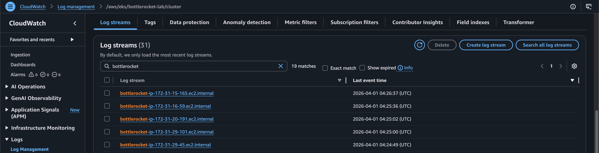

# bottlerocket-lab
Bottlerocket

### GitHub Actions Workflow

The repository now includes a manual workflow at `.github/workflows/provision-cluster-and-deploy-app.yml` that:

1. Runs `terraform init`, `plan`, and `apply` inside `cluster/`
2. Updates the kubeconfig for the newly created EKS cluster
3. Waits for the `karpenter` deployment rollout to complete on Fargate
4. Applies `app/nginx-deployment.yaml` and waits for the `nginx` rollout

Configure one of these authentication options in your GitHub repository before running the workflow:

- Recommended: `AWS_ROLE_ARN` for GitHub OIDC federation
- Alternative: `AWS_ACCESS_KEY_ID` and `AWS_SECRET_ACCESS_KEY`

The workflow is pinned to `us-east-1`, matching the Terraform defaults in this repository.

> **Important:** the Terraform configuration in this repository does not define a remote backend. The workflow will still work for a single run, but repeated CI applies should use a shared backend such as S3 to preserve Terraform state between runs.

> **Important:** the workflow now provisions Karpenter on EKS Fargate. AWS only supports EKS Fargate on private subnets, so the cluster configuration must either create or use private subnets in the selected VPC.

### Karpenter and Fargate

The cluster control plane and Karpenter-managed Bottlerocket worker nodes still use the selected public subnets, but the `karpenter` controller now runs on a dedicated EKS Fargate profile.

By default, the Terraform in `cluster/network.tf` now creates three private subnets in `us-east-1a`, `us-east-1b`, and `us-east-1c`, plus a single NAT Gateway and a private route table for the Fargate profiles. If you already have private subnets, set `fargate_subnet_ids` to use them directly. If you want to disable the automatic network path, set `create_fargate_private_network = false`.

### Customizing Bottlerocket user data

The Bottlerocket nodes are now provisioned by Karpenter through an `EC2NodeClass`, so custom TOML user data lives in `cluster/templates/bottlerocket-user-data.toml.tftpl`.

The `EC2NodeClass` and `NodePool` definitions now live in a local Helm chart under `cluster/charts/karpenter-resources`, and Terraform applies them with `helm_release.karpenter_resources` instead of `kubectl apply`.

Terraform still renders the Bottlerocket TOML with `templatefile(...)` and passes the result to `spec.userData` on the Bottlerocket `EC2NodeClass`. The default `NodePool` is now constrained to `arm64`, so Karpenter provisions Graviton-backed nodes.

That user data now also enables a custom Bottlerocket host container named `log-shipper`, backed by `aws-for-fluent-bit`. It reads the Bottlerocket system journal directly from the host and sends it to the same CloudWatch Logs group used by the cluster through the native `cloudwatch_logs` output plugin, using log streams in the `bottlerocket-<private-dns>` pattern from the journal `_HOSTNAME` field and falling back to `bottlerocket-host` if the record accessor cannot resolve `_HOSTNAME`. The Fluent Bit config now uses a single broad host-journal input, so `kubelet.service`, `containerd.service`, `host-containerd.service`, `host-containers@log-shipper.service`, and other host units are all collected together in the same host stream.

Bottlerocket host containers do not expose Kubernetes-style CPU and memory limits through `settings.host-containers.*`. In this repository, the practical guardrail is internal Fluent Bit buffering, controlled by `bottlerocket_log_shipper_storage_backlog_mem_limit` and `bottlerocket_log_shipper_input_mem_buf_limit` in `cluster/variables.tf`.

The log shipper now also uses a more defensive Fluent Bit setup for host-level logging: `bottlerocket_log_shipper_storage_max_chunks_up` caps how many filesystem chunks can stay promoted in memory, `storage.pause_on_chunks_overlimit` pauses ingestion instead of growing unbounded memory, `bottlerocket_log_shipper_output_storage_total_limit_size` caps the per-output on-disk backlog, `bottlerocket_log_shipper_max_entries` limits journal reads per cycle, and `bottlerocket_log_shipper_db_sync` controls cursor durability for the systemd input database.

The Fluent Bit log level is also configurable through `bottlerocket_log_shipper_log_level` in `cluster/variables.tf`. Accepted values are `off`, `error`, `warn`, `info`, `debug`, and `trace`. The levels are hierarchical, so `warn` logs both warnings and errors, while `error` logs only errors.

The BRUPOP release is also parametrized through Terraform variables, so you can control `scheduler_cron_expression`, `update_window_start`, `update_window_stop`, `max_concurrent_updates`, and `exclude_from_lb_wait_time_in_sec` from `cluster/variables.tf` without editing the Helm release directly. The current defaults schedule one run per day at `01:00 UTC`, inside the `00:00:00` to `02:00:00` maintenance window.

### Infrastructure components

| Resource | Purpose |
|---|---|
| `aws_cloudwatch_log_group.eks` | Stores EKS control-plane logs |
| `aws_eks_addon.vpc_cni`, `aws_eks_addon.kube_proxy`, and `aws_eks_addon.coredns` | Installs the core EKS managed add-ons for cluster networking and DNS |
| `aws_eks_addon.pod_identity_agent` | Installs the EKS Pod Identity Agent add-on required before creating Pod Identity associations |
| `aws_eks_fargate_profile.karpenter` | Runs the Karpenter controller on Fargate instead of EC2 nodes |
| `helm_release.karpenter` | Installs the Karpenter controller with IRSA and interruption handling |
| `helm_release.karpenter_resources` | Applies the local Helm chart that manages the Karpenter `EC2NodeClass` and `NodePool` resources |
| `helm_release.metrics_server` | Installs metrics-server in `kube-system` so the cluster can serve resource metrics |
| `helm_release.kube_state_metrics` | Installs kube-state-metrics in `kube-system` for Kubernetes object state metrics |
| `helm_release.cert_manager` | Installs cert-manager and its CRDs, required by the Bottlerocket Update Operator |
| `helm_release.bottlerocket_shadow` | Installs the `bottlerocket-shadow` CRD chart before the Bottlerocket Update Operator |
| `helm_release.bottlerocket_update_operator` | Installs the Bottlerocket Update Operator chart after cert-manager and the Bottlerocket Shadow CRD |
| `enabled_cluster_log_types` on `aws_eks_cluster.this` | Sends API, audit, authenticator, controller-manager, and scheduler logs to CloudWatch |
